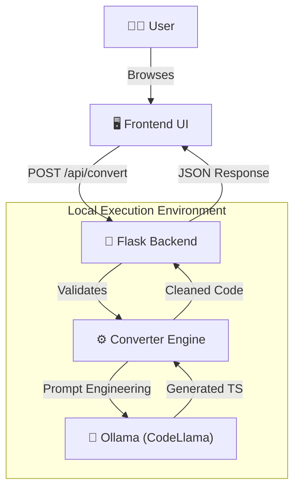

# 🚀 Selenium to Playwright Converter (Local AI)

A robust, privacy-first internal tool that leverages **Local AI (Ollama + CodeLlama)** to intelligently convert legacy **Java Selenium** test code into modern **TypeScript Playwright** scripts.

built with the **B.L.A.S.T.** protocol (Blueprint, Link, Architect, Stylize, Trigger).

---

## 🏗️ Architecture

The system follows a 3-layer architecture to ensure separation of concerns and reliability.



### Core Components
1.  **Frontend (UI)**: A split-pane, dark-mode editor (HTML/CSS/JS) that mimics a VS Code experience.
2.  **Backend (API)**: A lightweight Python Flask server (`tools/server.py`) that handles requests and sanitizes inputs.
3.  **AI Engine**: A local instance of **Ollama** running the `codellama` model to perform the logic translation (Java -> TS).

---

## 🛠️ Prerequisites

Before running the application, ensure you have the following installed:

1.  **Python 3.10+**: [Download Here](https://www.python.org/downloads/)
2.  **Ollama**: [Download Here](https://ollama.com/)
3.  **CodeLlama Model**: Run the following in your terminal:
    ```bash
    ollama pull codellama
    ```

---

## ⚡ Installation & Setup

1.  **Clone/Open the Project**
    Navigate to the project directory:
    ```bash
    cd SeleniumToPlaywrightConverter
    ```

2.  **Create a Virtual Environment** (Recommended)
    ```bash
    python -m venv .venv
    # Windows
    .venv\Scripts\activate
    # Mac/Linux
    source .venv/bin/activate
    ```

3.  **Install Dependencies**
    ```bash
    pip install -r requirements.txt
    ```

4.  **Verify AI Connection**
    Run the handshake script to ensure Ollama is reachable:
    ```bash
    python tools/ollama_handshake.py
    ```
    *Output should say: `✅ 'codellama' model found.`*

---

## 🚀 Usage

1.  **Start the Server**
    ```bash
    python tools/server.py
    ```
    You should see: `* Running on http://127.0.0.1:5000`

2.  **Open the App**
    Open your web browser to **[http://localhost:5000](http://localhost:5000)**.

3.  **Convert Code**
    *   **Left Pane**: Paste your Java Selenium class or test method.
    *   **Click**: The "⚡ Convert" button in the center.
    *   **Wait**: The local AI will process the logic (approx. 10-30 seconds).
    *   **Right Pane**: Copy your new Playwright TypeScript code!

---

## 🧪 Example Conversion

**Input (Java):**
```java
@Test
public void loginTest() {
    driver.get("https://example.com");
    driver.findElement(By.id("user")).sendKeys("admin");
    driver.findElement(By.cssSelector(".submit-btn")).click();
    Assert.assertTrue(driver.getCurrentUrl().contains("/dashboard"));
}
```

**Output (Playwright TS):**
```typescript
test('loginTest', async ({ page }) => {
  await page.goto('https://example.com');
  await page.locator('#user').fill('admin');
  await page.locator('.submit-btn').click();
  await expect(page).toHaveURL(/\/dashboard/);
});
```

---

## 📂 Project Structure

```
SeleniumToPlaywrightConverter/
├── architecture/        # SOPs & Architecture Docs
│   ├── 01_conversion_sop.md
│   ├── 02_backend_sop.md
│   └── 03_frontend_sop.md
├── static/             # Frontend Assets
│   ├── index.html
│   ├── style.css
│   └── script.js
├── tools/              # Python Scripts
│   ├── converter.py    # AI Logic Wrapper
│   └── server.py       # Flask App
├── requirements.txt    # Python Dependencies
└── gemini.md           # Project Constitution (Data Schema)
```

